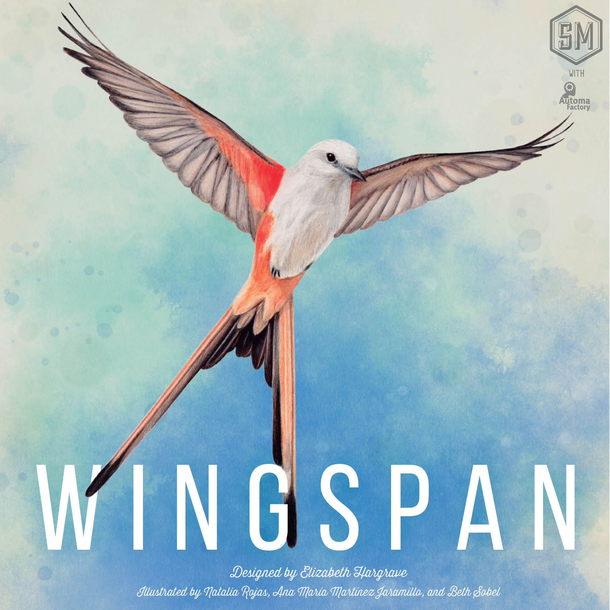
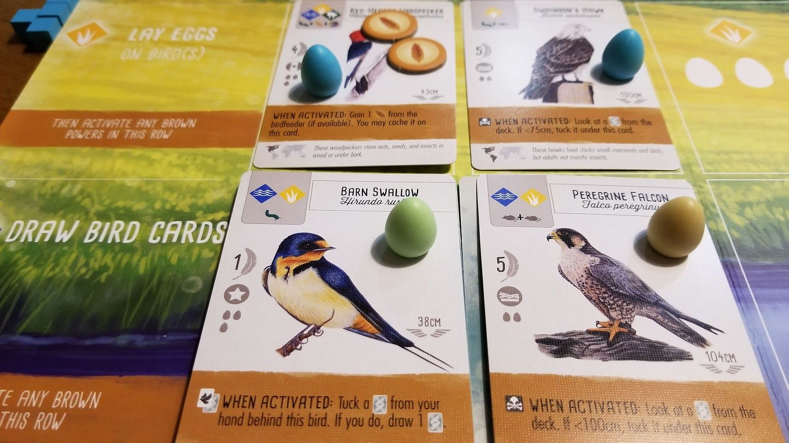
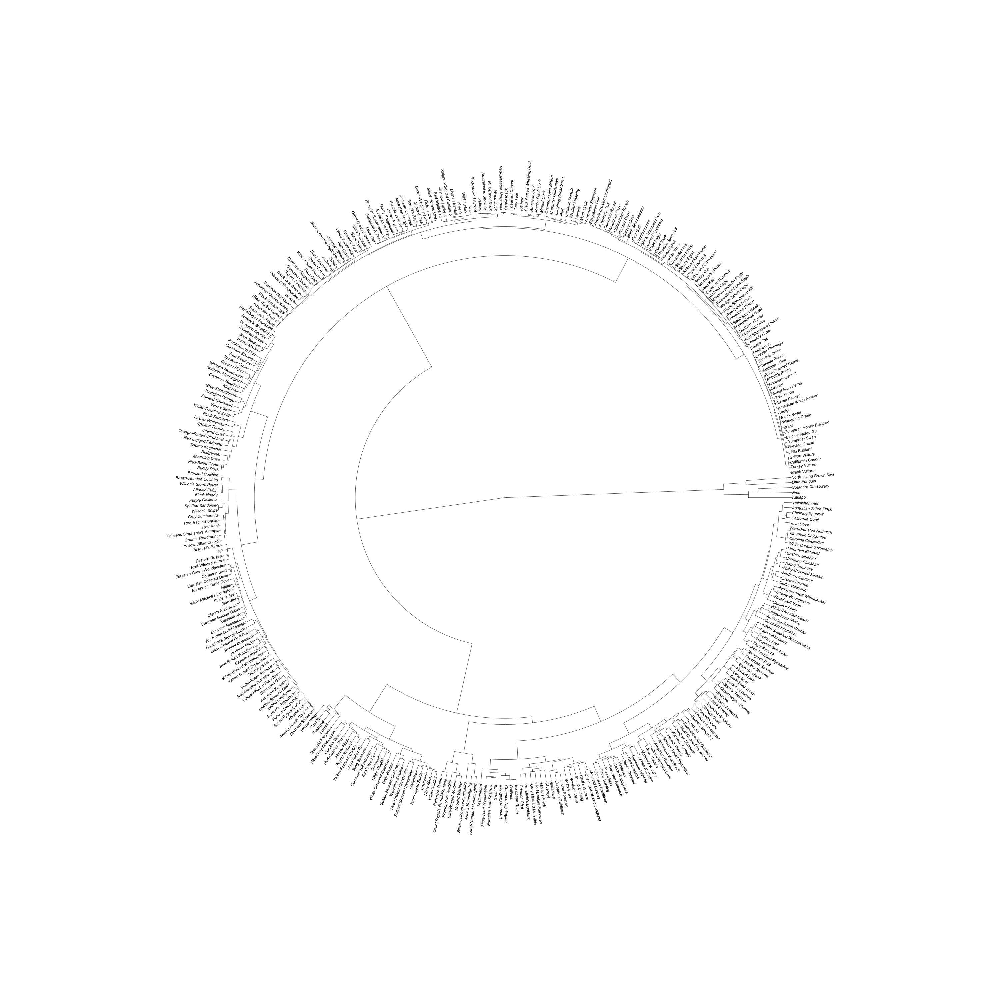
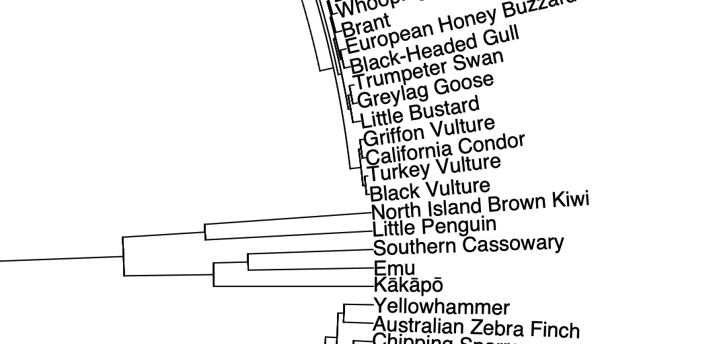
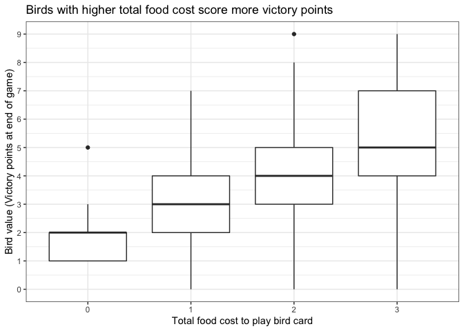

<!-- README.md is generated from README.Rmd. Please edit that file -->

# Wingspan 

<!-- badges: start -->


<!-- badges: end -->

The R `{wingspan}` package makes available information about the birds
and bonus cards in the boardgame
[wingspan](https://stonemaiergames.com/games/wingspan/)

Wingspan (the boardgame) was designed by Elizabeth Hargrave, with art by
Natalia Rojas, Ana Maria Martinez Jaramillo, and Beth Sobel

The boardgame is a competitive, medium-weight, card-driven,
engine-building board game, and is absolutely delightful!

This package just provides stats and data on the cards in the box - it
won’t really help you to play the game, and doesn’t include any of the
amazing artwork; it’s just the facts about all birds and bonus cards as
collected by
[TawnyFrogmouth](https://boardgamegeek.com/user/TawnyFrogmouth) at
[BoardGameGeek](https://boardgamegeek.com/boardgame/266192/wingspan)
([original
data](https://boardgamegeek.com/filepage/193164/wingspan-bird-card-bonus-card-spreadsheet)).

<div style="clear:both;" />

## What’s in the box

-   `birds` a data.frame of information about each of the cards in the
    base game and the expansions (europe and oceania)
-   `bonus_cards` information about the cards used to give you a bonus
    at the end of the game (based upon the numbers of birds of different
    types you accumulate during the game)

## Installation

You can install from
[GitHub](https://github.com/coolbutuseless/wingspan) with:

``` r
# install.package('remotes')
remotes::install_github('coolbutuseless/wingspan')
```

### Example Bird Data



Some of the stats for the 2 birds at the bottom of this image are shown
below.

``` r
library(ape)
library(vegan)
#> Loading required package: permute
#> Loading required package: lattice
#> This is vegan 2.5-7
library(dplyr)
library(wingspan)

wingspan::birds %>% 
  filter(common_name %in% c('Barn Swallow', 'Peregrine Falcon')) %>%
  select(common_name, scientific_name, points = victory_points, predator, 
         egg_capacity, nest_type, total_food_cost) %>%
  knitr::kable()
```

| common\_name     | scientific\_name | points | predator | egg\_capacity | nest\_type | total\_food\_cost |
|:-----------------|:-----------------|-------:|:---------|--------------:|:-----------|------------------:|
| Barn Swallow     | Hirundo rustica  |      1 | FALSE    |             3 | Wild       |                 1 |
| Peregrine Falcon | Falco peregrinus |      5 | TRUE     |             2 | Platform   |                 2 |

### Radial Dendrogram

Thanks to [hbgoldspiel](https://twitter.com/hbgoldspiel) on twitter for
this great dendogram grouping birds by their similarity.

``` r
#~~~~~~~~~~~~~~~~~~~~~~~~~~~~~~~~~~~~~~~~~~~~~~~~~~~~~~~~~~~~~~~~~~~~~~~~~~~~~
# Replace NAs
#~~~~~~~~~~~~~~~~~~~~~~~~~~~~~~~~~~~~~~~~~~~~~~~~~~~~~~~~~~~~~~~~~~~~~~~~~~~~~
birds2 <- birds %>%
  tidyr::replace_na(list(
    power_color    = 'None',
    power_category = 'None',
    nest_type      = 'Misc',
    wingspan       = 0
  ))


#~~~~~~~~~~~~~~~~~~~~~~~~~~~~~~~~~~~~~~~~~~~~~~~~~~~~~~~~~~~~~~~~~~~~~~~~~~~~~
# Numeric matrix of traits
#~~~~~~~~~~~~~~~~~~~~~~~~~~~~~~~~~~~~~~~~~~~~~~~~~~~~~~~~~~~~~~~~~~~~~~~~~~~~~
birds_mat <- as.data.frame(model.matrix(
  lm(
    victory_points ~ set + power_color + power_category + predator + 
      flocking + bonus_card + nest_type + egg_capacity + wingspan + 
      forest + grassland + wetland + invertebrate + seed + fish + fruit +
      rodent + nectar + any_food - 1, data = birds2
  )
))

rownames(birds_mat) <- birds$common_name
birds_mat$points    <- birds$victory_points

#~~~~~~~~~~~~~~~~~~~~~~~~~~~~~~~~~~~~~~~~~~~~~~~~~~~~~~~~~~~~~~~~~~~~~~~~~~~~~
# Calcualte Distance matrix
#~~~~~~~~~~~~~~~~~~~~~~~~~~~~~~~~~~~~~~~~~~~~~~~~~~~~~~~~~~~~~~~~~~~~~~~~~~~~~
birds_norm <- vegan::decostand(birds_mat, "normalize")
birds_ch   <- vegan::vegdist(birds_norm, 'euc')
attr(birds_ch, 'labels') <- rownames(birds_mat)


#~~~~~~~~~~~~~~~~~~~~~~~~~~~~~~~~~~~~~~~~~~~~~~~~~~~~~~~~~~~~~~~~~~~~~~~~~~~~~
# Compute Ward's minimumvariance clustering
#~~~~~~~~~~~~~~~~~~~~~~~~~~~~~~~~~~~~~~~~~~~~~~~~~~~~~~~~~~~~~~~~~~~~~~~~~~~~~
birds_ch_ward <- hclust(birds_ch, method = 'ward.D2')
```

``` r
plot(ape::as.phylo(birds_ch_ward), type = "fan", cex = 1)
```



The full dendogram is huge, but a glimpse at detail below shows that
flightless birds have been grouped together. Also there’s a grouping of
condors and vultures.



<a href="man/figures/phylo.pdf">Download PDF version of dendogram</a>

### Example Summary Plot

``` r
library(ggplot2)

ggplot(birds, aes(as.factor(total_food_cost), victory_points)) + 
  geom_boxplot() + 
  theme_bw() + 
  labs(
    x = "Total food cost to play bird card",
    y = "Bird value (Victory points at end of game)",
    title = "Birds with higher total food cost score more victory points"
  ) + 
  scale_y_continuous(breaks = 0:10)
```



## Acknowledgements

-   [TawnyFrogmouth](https://boardgamegeek.com/user/TawnyFrogmouth) at
    [BoardGameGeek](https://boardgamegeek.com/boardgame/266192/wingspan)
    for collating and sharing [the
    data](https://boardgamegeek.com/filepage/193164/wingspan-bird-card-bonus-card-spreadsheet)
-   [Stonemeier games](https://stonemaiergames.com/games/wingspan/) for
    releasing such a delicious game
-   R Core for developing and maintaining the language.
-   CRAN maintainers, for patiently shepherding packages onto CRAN and
    maintaining the repository
